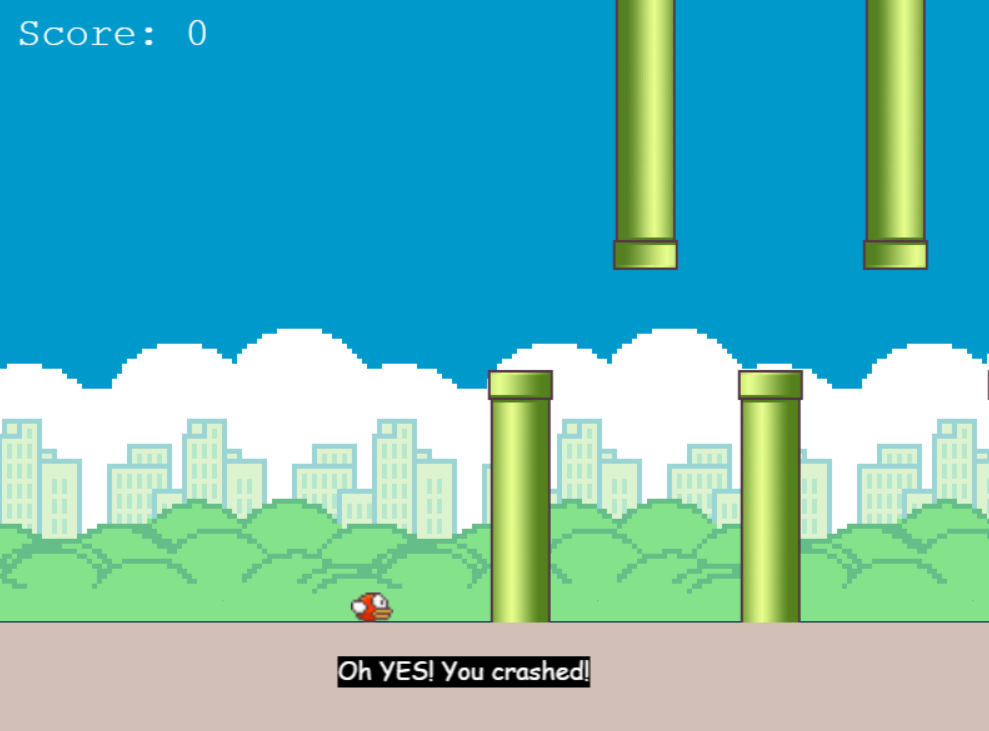

# Flappy Bird Clone

A simple Flappy Bird clone built using Phaser JS, a fast and fun open-source framework for Canvas and WebGL-powered browser games. This project is an excellent way to learn game development basics and explore the Phaser framework.

---

## Screenshot

  


---

## Table of Contents

- [Demo](#demo)
- [Features](#features)
- [Technologies Used](#technologies-used)
- [Installation](#installation)
- [How to Play](#how-to-play)
- [Contributing](#contributing)

---

## Demo

You can play the game live here: [Live Demo](https://ahmad-bradii.github.io/Flappy-Bird-Clone-/)  


---

## Features

- Classic Flappy Bird gameplay mechanics.
- Responsive design for desktop and mobile devices.
- Score tracking to challenge yourself or friends.
- Simple and intuitive controls.
- Custom assets and animations.

---

## Technologies Used

- **Phaser JS** - A powerful framework for 2D game development.
- **HTML5 & CSS3** - For structuring and styling the game.
- **JavaScript** - For game logic and functionality.

---

## Installation

To run this game locally, follow these steps:

1. Clone the repository:

   ```bash
   git clone https://github.com/your-username/flappy-bird-clone.git


2. Navigate to the project directory:

   
   ```bash
   cd flappy-bird-clone

3. Open the game in your browser:

- Simply open the index.html file in your preferred browser.
- Alternatively, use a local server (e.g., live-server or http-server) to run the game.

## How to Play
Press the Spacebar or Click any where to make the bird flap and stay in the air.
Avoid hitting the pipes or the ground.
Each successful pass through a pair of pipes increases your score.
The game ends when the bird collides with an obstacle, and it also concludes when the bird reaches the maximum score.


## Contributing
Contributions are welcome! If you'd like to improve this project, feel free to:

1. Fork the repository.

2. Create a new branch:

   ```bash
   git checkout -b feature/YourFeatureName

3. Commit your changes:
   
   ```bash
   git commit -m "Add some feature" de

4. Push to the branch:
   ```bash
    git push origin feature/YourFeatureName

5.Open a pull request:

  - Please ensure your code follows the existing style and includes appropriate documentation.

  


 

